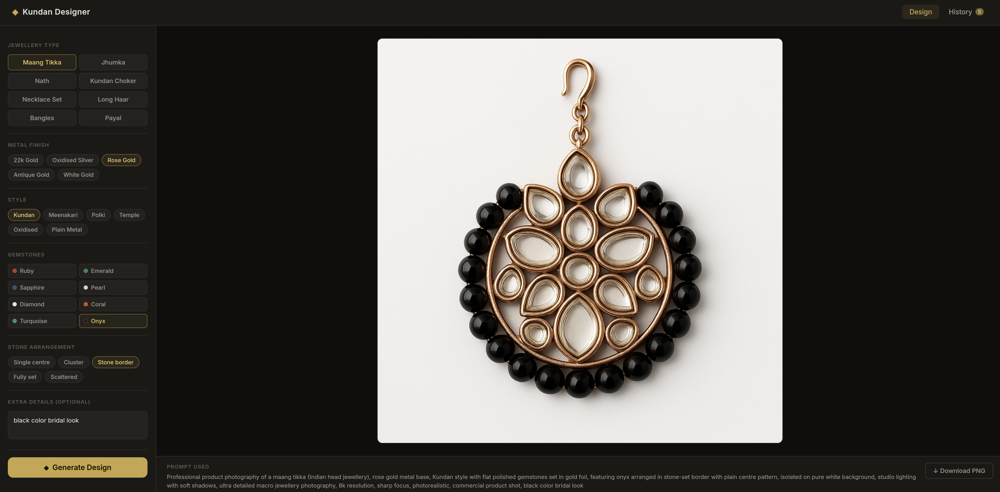

# Kundan Designer

[](https://github.com/anoopsimon/kundan-designer/actions/workflows/ci.yml)
[](./LICENSE)
[](https://platform.openai.com/docs/models/gpt-image-1)

AI-powered Indian jewellery design generator. Configure a piece and turn it into a photorealistic render with OpenAI's `gpt-image-1` model.

Built to be easy to demo, easy to remix, and visually strong enough to share without extra explanation.

## Preview

<p align="center">
  
</p>

## Highlights

- Instant product-style renders for Kundan, Polki, Meenakari, temple, oxidised, and plain metalwork.
- One-command startup for the full stack.
- Clean Go backend plus React frontend.
- Session history and PNG download built in.
- Strong niche focus: Indian jewellery designers, boutique owners, bridal styling, and fashion-tech builders.

## Stack

- **Frontend**: React + Vite (dark gold UI)
- **Backend**: Go (stdlib only, no external deps)
- **Image generation**: OpenAI `gpt-image-1`

---

## Quick start

### 1. Set your OpenAI API key

```bash
export OPENAI_API_KEY=sk-your-key-here
```

You need an OpenAI account with access to `gpt-image-1`. Get a key at https://platform.openai.com/api-keys

### 2. Start the backend (terminal 1)

```bash
chmod +x start-backend.sh
./start-backend.sh
```

Backend runs on http://localhost:8081

### Optional: start both services with one command

```bash
chmod +x start.sh
./start.sh
```

### 3. Start the frontend (terminal 2)

```bash
chmod +x start-frontend.sh
./start-frontend.sh
```

Frontend runs on http://localhost:5173 — open this in your browser.

---

## Project structure

```
kundan-designer/
├── backend/
│   ├── main.go          ← Go HTTP server + prompt builder + OpenAI call
│   └── go.mod
├── frontend/
│   ├── src/
│   │   ├── App.jsx               ← layout, state, tabs
│   │   ├── components/
│   │   │   ├── Configurator.jsx  ← left panel: piece/metal/stone/style pickers
│   │   │   ├── Canvas.jsx        ← right panel: image display + download
│   │   │   └── History.jsx       ← grid of past designs
│   ├── index.html
│   └── vite.config.js   ← proxies /api → :8081
├── start-backend.sh
├── start.sh
├── start-frontend.sh
└── README.md
```

---

## What you can configure

| Option | Choices |
|--------|---------|
| Piece type | Maang Tikka, Jhumka, Nath, Choker, Necklace, Haar, Bangles, Payal |
| Metal | 22k Gold, Oxidised Silver, Rose Gold, Antique Gold, White Gold |
| Style | Kundan, Meenakari, Polki, Temple, Oxidised, Plain |
| Stones | Ruby, Emerald, Sapphire, Pearl, Diamond, Coral, Turquoise, Onyx |
| Arrangement | Single centre, Cluster, Stone border, Fully set, Scattered |
| Extra prompt | Free text to add any detail |

## Try these prompts

- Bridal Kundan choker with ruby and emerald accents, heavy gold base, temple border, pure white background
- South Indian temple necklace with antique gold, pearl drops, intricate motifs, luxury catalog photography
- Oxidised silver jhumka with turquoise and coral stones, asymmetrical cluster setting, studio product shot

---

## API endpoints

| Method | Path | Description |
|--------|------|-------------|
| POST | `/api/generate` | Generate image from config |
| GET | `/api/history` | Get session history |
| GET | `/api/health` | Health check |

### POST /api/generate payload

```json
{
  "pieceType": "tikka",
  "metal": "gold",
  "style": "kundan",
  "stones": ["ruby", "emerald"],
  "arrangement": "single",
  "extraPrompt": "bridal style with peacock motif"
}
```

---

## Production build (single binary + static files)

```bash
# Build frontend
cd frontend && npm run build

# Run backend (serves frontend from ../frontend/dist automatically)
cd ../backend && go build -o kundan-designer && PORT=8081 ./kundan-designer
```

Everything on http://localhost:8081 — no separate frontend process needed.

---

## Tailscale access

Since this runs locally, expose it over Tailscale for access from other devices:

```bash
# The app will be reachable at http://your-tailscale-ip:8081
# No extra config needed — just run the backend on your Linux server
```

---

## Costs

`gpt-image-1` at 1024×1024 high quality costs approximately **$0.04–0.08 per image** depending on your OpenAI tier. There's no monthly fee — pay per generation only.
